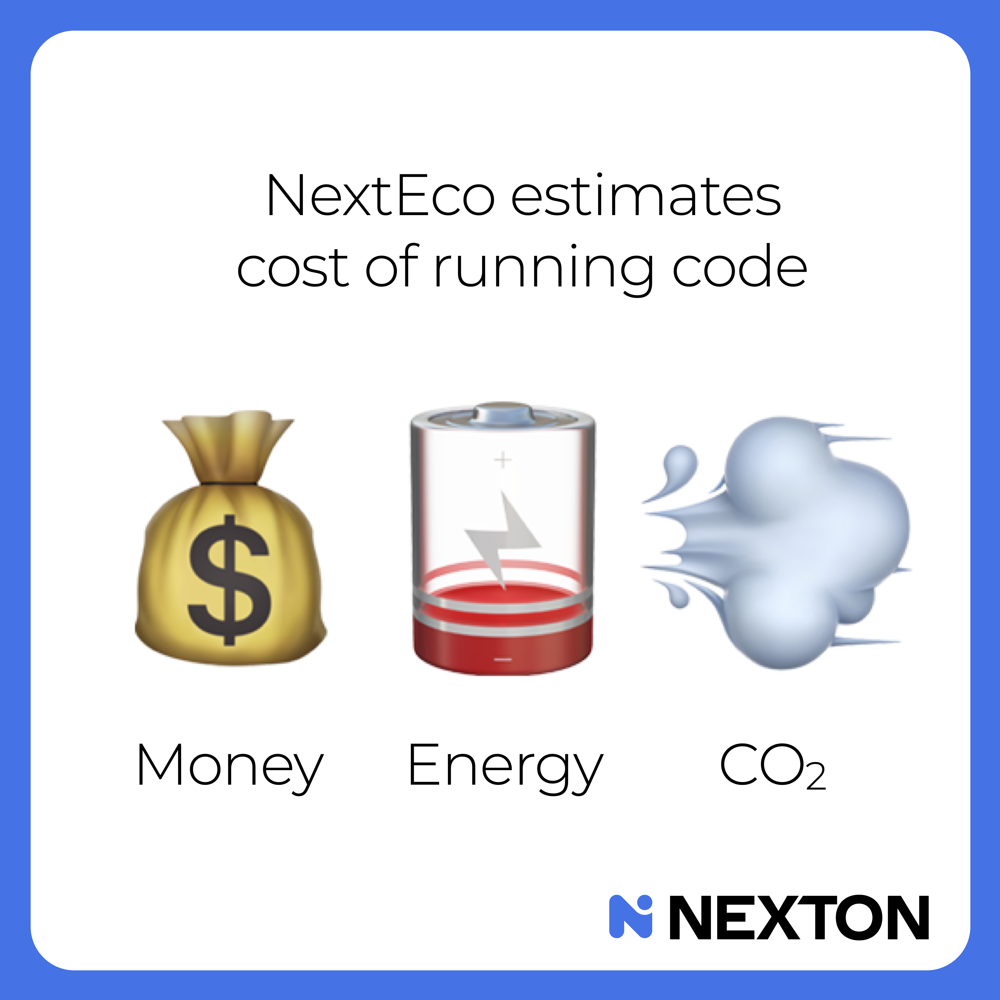

# NextEco

[](#install)
[](LICENSE)

[](LISEZMOI.md)
[](README.md)




NextEco estimates cost of running code in 💰 money, ⏱️ time, 🪫 energy, and 💨 CO2.

Not as vague storytelling.  
As a **small, repository-native subsystem** that teams can review, validate, benchmark, and maintain.

NextEco is built around a pattern:

- one **canonical unit of work**
- one **YAML source of truth**
- one **generated Markdown report**
- one **validation pass**
- one **benchmark path**

That makes cost-of-running a normal engineering concern, alongside correctness, latency, reliability, and memory.

---

## Context and Motivation

### Is this for Python only?

No.

The CLI is written in Python because Python is a pragmatic packaging language for developer tooling. But **NextEco works for repositories in any programming language** as long as the repository can define a representative unit of work and measure or estimate it.

Typical fits include:

- Python
- JavaScript / TypeScript / Node.js
- Go
- Rust
- Java
- Kotlin
- C / C++
- C#
- PHP
- Ruby
- Swift
- Scala
- Bash-heavy repos
- polyglot monorepos

If a repository can answer questions like:

- one API request
- one CLI invocation
- one batch job
- one inference
- one evaluation run
- one training run
- one build step

then NextEco can model it.

### Is this for AI repos only?

No.

It is for **all repositories**, not only AI repositories.

That said, it is especially useful for AI systems because AI stacks often combine:

- local compute
- external APIs
- long runtimes
- model inference
- geographically sensitive energy and CO2 assumptions

So NextEco is **general-purpose**, while remaining highly relevant to AI and ML work.

### Is this for infra teams?

Yes — and not only for infra teams.

It is for **everybody creating, running, reviewing, or maintaining projects**:

- infra teams
- backend teams
- ML / AI teams
- consulting teams
- maintainers
- engineering managers
- architects
- technical auditors

If someone might ask **“what does this cost to run?”**, NextEco is for them.

### Is this just a YAML templating tool?

No.

YAML is used as a **source of truth for reproducibility, reviewability, and long-term maintenance**. It is not the product itself.

NextEco gives teams a disciplined way to answer cost / time / energy / CO2 questions by combining:

- explicit assumptions
- measured values when available
- estimated values when necessary
- provenance metadata
- arithmetic validation
- generated human-readable reports
- benchmarkable workflows

The YAML file exists so the result can live in the repository, be reviewed in pull requests, and remain understandable over time.

### Why would I use this instead of a spreadsheet?

You should consider our analysis as a playable movie, not a static photograph because a spreadsheet usually stores results, while **NextEco connects those results to the actual behavior of the repository**.

In practice, NextEco supports a lightweight form of **dynamic program analysis** helping you:

1. define a canonical unit of work
2. run or benchmark that unit of work
3. collect runtime evidence from the program or its environment
4. combine those measurements with explicit pricing, power, and carbon assumptions
5. validate the arithmetic
6. render the result into repository documentation

So this is not just “cells with numbers.” It is a repository-native bridge between:

- program execution
- benchmark evidence
- pricing assumptions
- engineering documentation

That is why it ages better than an isolated spreadsheet.

---

## Why NextEco exists

Modern software is increasingly:

- compute-heavy
- API-heavy
- model-heavy
- geographically sensitive in cost and CO2 terms

Yet most repositories still cannot answer basic engineering questions starting from:

> **What is the cost of one representative unit of work?**

What does one request cost?  
What does one batch job cost?  
What does one inference cost?  
What does one training run cost?  
Which part is local compute, and which part is external API spend?

NextEco helps teams answer those questions with a workflow that is:

- small
- explicit
- reviewable
- reproducible
- benchmark-aware
- honest about uncertainty

It is **not** a dashboard.  
It is **not** SaaS.  
It is **not** ESG theater.  
It is **not** AI-made-up numbers.

It is a lightweight developer tool and an agent-friendly workflow.

---

## What you get

In this repository:

- a Python CLI
- reusable YAML templates
- validation logic
- readable Markdown report generation
- benchmark helpers
- tests
- examples
- methodology docs
- audience-specific READMEs
- an embedded skill for agent-native workflows

The result is not a one-off report. It is a **maintainable subsystem**.

---

## Quick start

```bash
pip install .
nexteco init --template min
nexteco validate cost_of_running.yaml
nexteco render cost_of_running.yaml --output cost_of_running.md
python scripts/benchmark_render.py cost_of_running.yaml --iterations 10
```

---

## Install

### From source

```bash
pip install .
```

### For development

```bash
pip install -e .[dev]
pytest
```

---

## CLI

### Initialize a model

```bash
nexteco init --template min --output cost_of_running.yaml
nexteco init --template full --force
```

### Validate a model

```bash
nexteco validate cost_of_running.yaml
```

Validate structure, statuses, arithmetic coherence, and provenance freshness signals.

### Render a report

```bash
nexteco render cost_of_running.yaml --output docs/cost_of_running.md
```

Generate a human-readable Markdown report from the YAML source of truth.

### Benchmark

```bash
python scripts/benchmark_render.py cost_of_running.yaml --iterations 20
python scripts/benchmark_render.py cost_of_running.yaml --iterations 20 --json
```

Benchmark the end-to-end path around loading, validation, and rendering for a representative file.

---

## Who this is for

NextEco is for teams who want **cost-of-running** to become a normal engineering concern instead of an ad hoc conversation.

It is useful when you want to:

- document the cost of one representative request or job
- compare scenarios
- separate local compute from external API spend
- keep estimates honest
- make review easier for humans and AI agents
- leave behind a maintainable subsystem instead of a one-off note

It is especially relevant for:

- teams using paid APIs
- AI products with nontrivial inference costs
- developer tools with meaningful local compute usage
- data workflows with recurring jobs
- repositories where users or operators care about runtime footprint
- engineering organizations that want trustworthy sustainability discussions instead of theater

---

## Design principles

NextEco follows a doctrine:

1. choose one canonical unit of work
2. keep one YAML source of truth
3. generate human-readable Markdown from it
4. validate the logic that matters
5. benchmark when warranted
6. never blur measured and estimated values

The honesty taxonomy is central:

- `measured`
- `estimated`
- `placeholder`
- `TODO`

> **An honest placeholder beats a confident lie.**

---

## Methodology in one minute

NextEco treats cost as a software metric, alongside correctness, latency, memory, and reliability.

The model is expressed per **canonical unit of work** across four dimensions:

- 💰 **money**
- ⏱️ **time**
- 🪫 **energy**
- 💨 **CO2**

The math is intentionally and auditable:

$$
E_{kWh} = t_h \times P_{kW}
$$

$$
C_{USD} = E_{kWh} \times p_{USD/kWh}
$$

$$
CO2e_g = E_{kWh} \times I_{gCO2e/kWh}
$$

| Symbol | Meaning | Unit |
|---|---|---|
| $E_{\mathrm{kWh}}$ | Energy consumed | kWh |
| $t_{\mathrm{h}}$ | Wall-clock runtime | hours |
| $P_{\mathrm{kW}}$ | Average power draw | kW |
| $C_{\mathrm{USD}}$ | Local compute electricity cost | USD |
| $p_{\mathrm{USD}/\mathrm{kWh}}$ | Electricity price | USD / kWh |
| $\mathrm{CO_2e}_{\mathrm{g}}$ | CO2 footprint | g CO2e |
| $I_{\mathrm{g\ CO_2e}/\mathrm{kWh}}$ | Grid CO2 intensity | g CO2e / kWh |

The point is not sophistication.  
The point is **clarity, auditability, and testability**.

When direct measurement is possible, NextEco can align with OS-level tools such as:

- `sudo powermetrics` on macOS
- `sudo powertop` or `sudo turbostat` on Linux
- `powercfg` or `perfmon` on Windows (may require Administrator privileges)

When direct measurement is not available, the framework requires visible estimation, placeholders, or `TODO`s.

That is not a weakness.  
That is scientific hygiene.

---

## Documentation map

This README is for broad public discovery.

For more focused reading:

- [README4MAINTAINERS.md](README4MAINTAINERS.md) — for repository maintainers and engineering teams
- [README4CONSULTANTS.md](README4CONSULTANTS.md) — for consulting, audit, and client-facing usage
- [README4AGENTS.md](README4AGENTS.md) — for AI-assisted IDE and agent-native workflows

And the deeper docs:

- [docs/methodology.md](docs/methodology.md)
- [docs/yaml-schema.md](docs/yaml-schema.md)
- [docs/repo-archetypes.md](docs/repo-archetypes.md)
- [docs/benchmark-patterns.md](docs/benchmark-patterns.md)
- [docs/roadmap.md](docs/roadmap.md)

---

## Repository structure

```text
nexteco/
├── README.md
├── README4MAINTAINERS.md
├── README4CONSULTANTS.md
├── README4AGENTS.md
├── CHANGELOG.md
├── CONTRIBUTING.md
├── pyproject.toml
├── docs/
├── nexteco/
├── tests/
├── examples/
├── skill/
│   └── nexteco/
└── .github/
```

---

## Standalone and agent-native

NextEco exists in two complementary forms:

1. **this OSS repository** — for humans, open discussion, code, tests, examples, and releases
2. **an embedded skill** in [`skill/nexteco/`](skill/nexteco/) — for Claude-style agents and AI-powered IDE workflows

That split is intentional:

- the **repository** is the public source of truth
- the **skill** is the agent-native execution layer

The repo owns the source of truth.  
The skill inherits the workflow.

---

## Examples

Illustrative examples are included to show different cost profiles:

- [`examples/rag_llm_judge_chatgpt4o.md`](examples/rag_llm_judge_chatgpt4o.md) — API-dominated
- [`examples/rag_llm_judge_ollama_gemma3_4b.md`](examples/rag_llm_judge_ollama_gemma3_4b.md) — local-compute-dominated
- [`examples/generated_from_full_example.md`](examples/generated_from_full_example.md) — generated from the full template

The goal is not fake precision.  
The goal is honest, reusable engineering structure.

---

## What NextEco is not

NextEco does not try to replace:

- cloud billing platforms
- observability suites
- enterprise CO2 accounting systems

It solves a narrower problem:

> **How do you add an honest, lightweight, engineering-grade cost model directly into a software repository?**

That narrowness is one of its strengths.

---

## Contribution philosophy

NextEco should remain:

- small
- sharp
- auditable
- boring in the best sense
- honest about uncertainty

We prefer durable engineering assets over polished theater.

See [CONTRIBUTING.md](CONTRIBUTING.md).

---

## Author

[Warith Harchaoui, Ph.D.](https://www.linkedin.com/in/warith-harchaoui/), Head of AI at [NEXTON](https://nexton-group.com)

---

## Acknowledgments

This project grew out of discussions with:

- [Yann Lechelle](https://www.linkedin.com/in/ylechelle), leader and co-founder of [probabl.ai](https://probabl.ai)
- [Laurent Panatanacce](https://www.linkedin.com/in/panatanacce), AI Business Enabler at [NEXTON](https://nexton-group.com)

---

## License

[The Unlicense](https://unlicense.org) — public domain, no conditions.  
See [LICENSE](LICENSE).
